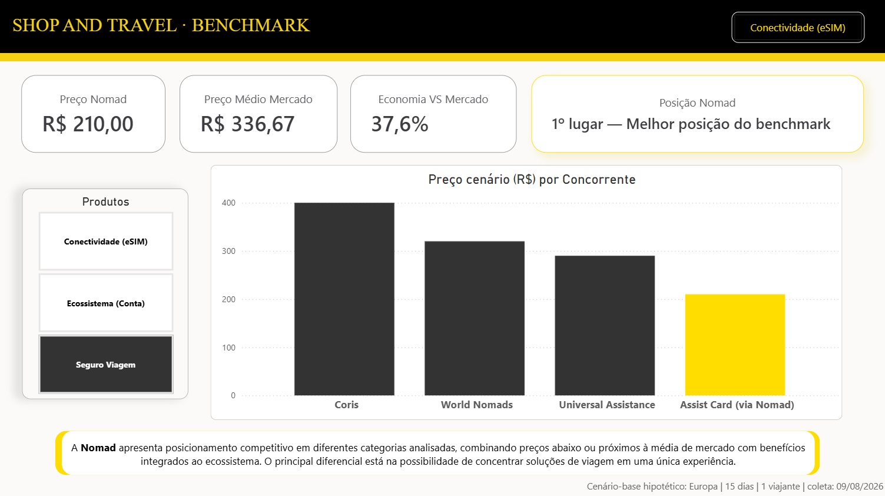
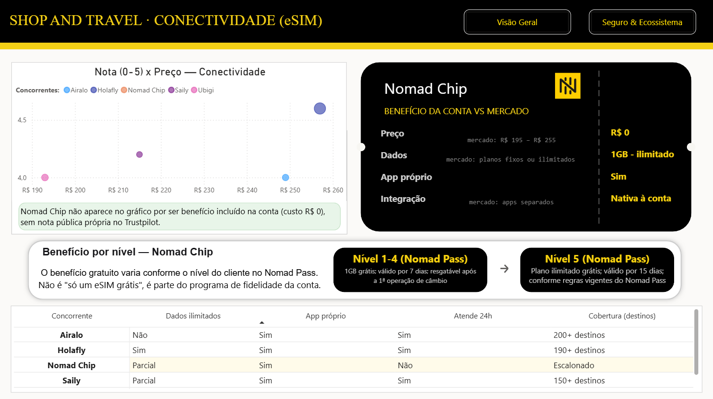
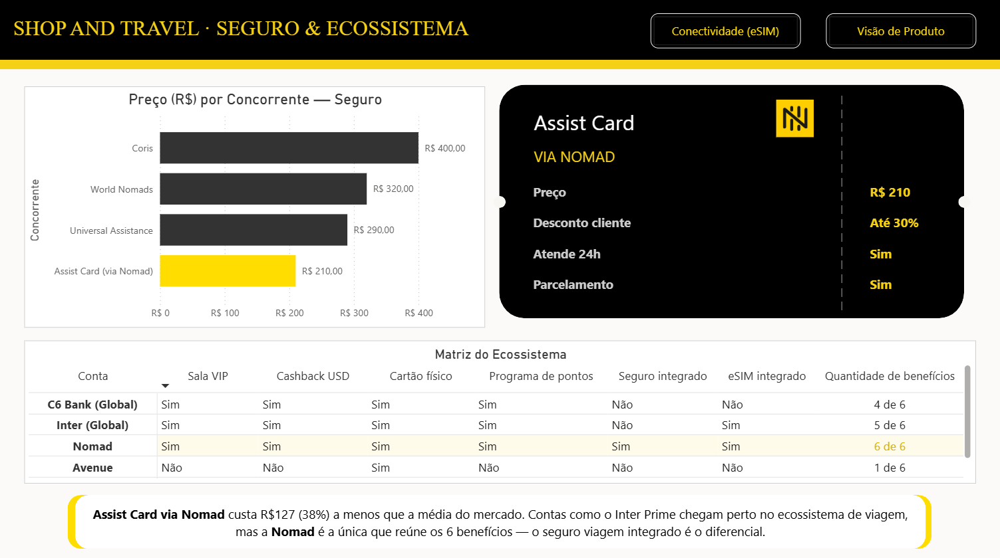
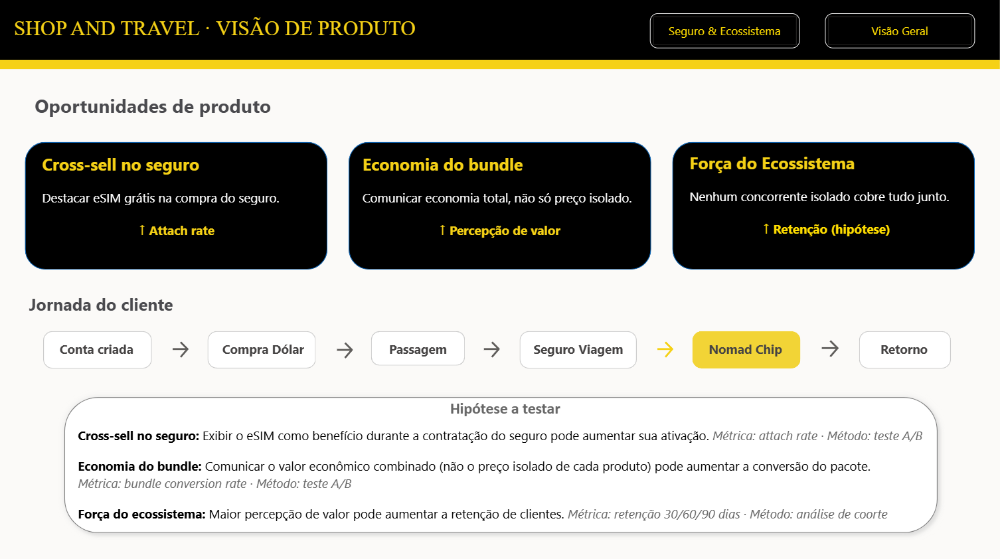

# 📊 Benchmark Competitivo — Shop and Travel

> ⚠️ Projeto de portfólio, sem vínculo com as empresas citadas. Os preços e benefícios dos concorrentes foram levantados via pesquisa própria em sites oficiais e podem não refletir valores atuais — o objetivo aqui é demonstrar a metodologia de análise, não servir como fonte de preços em tempo real.

## Objetivo

Dashboard de benchmark competitivo para os produtos de viagem da Nomad (eSIM, seguro viagem e conta multimoeda), comparando preço, benefícios e posicionamento frente aos principais concorrentes de cada categoria, com recomendações de oportunidade de produto baseadas na análise.

## Ferramentas

- Power BI
- DAX
- Power Query

## Estrutura do Dashboard

### 1. Visão Geral
- KPIs de posicionamento: Preço Nomad, Preço Médio de Mercado, Economia vs. Mercado e Posição no Benchmark
- Comparativo de preço por concorrente, navegável por categoria de produto (Conectividade, Ecossistema, Seguro Viagem)

### 2. Conectividade (eSIM)
- Nota x Preço dos concorrentes de eSIM (Airalo, Holafly, Saily, Ubigi)
- Comparativo de benefícios do Nomad Chip vs. mercado (dados, app próprio, integração)
- Estrutura de benefício escalonado (GB liberados conforme relacionamento com o cliente)
- Tabela comparativa de atributos por concorrente

### 3. Seguro & Ecossistema
- Comparativo de preço do seguro viagem por concorrente
- Detalhamento da oferta Assist Card via Nomad (preço, desconto, atendimento)
- Tabela comparativa de benefícios por conta (sala VIP, cashback, cartão físico, pontos, seguro e eSIM integrados)

### 4. Visão de Produto
- Oportunidades de produto identificadas (cross-sell no seguro, economia do bundle, força do ecossistema)
- Jornada do cliente mapeada (conta → dólar → passagem → seguro → eSIM → retorno)
- Hipóteses a testar, com métrica e método sugeridos para cada uma

## Principais análises

- Posicionamento de preço por categoria de produto
- Comparativo de benefícios entre Nomad e concorrentes diretos
- Economia percentual do ecossistema combinado vs. soluções isoladas
- Oportunidades de cross-sell e bundle dentro da jornada do cliente

## 🔗 Dashboard interativo
[Acessar dashboard](https://app.powerbi.com/view?r=eyJrIjoiZTQ3MzhkMGEtZGYxYi00NGU4LWFhZDYtNDZiOTY4MDBlOWM0IiwidCI6IjcyODMwODAzLTI3MmMtNDMwOC1hYTFhLTY3ZWRmNmQ5OWUyMiJ9&pageName=ac109a60a63acd8b05be)

## Preview

**Visão Geral**

**Conectividade (eSIM)**

**Seguro & Ecossistema**

**Visão de Produto**

## Contato
[LinkedIn](https://www.linkedin.com/in/fernanda-terra-3650a3265)
